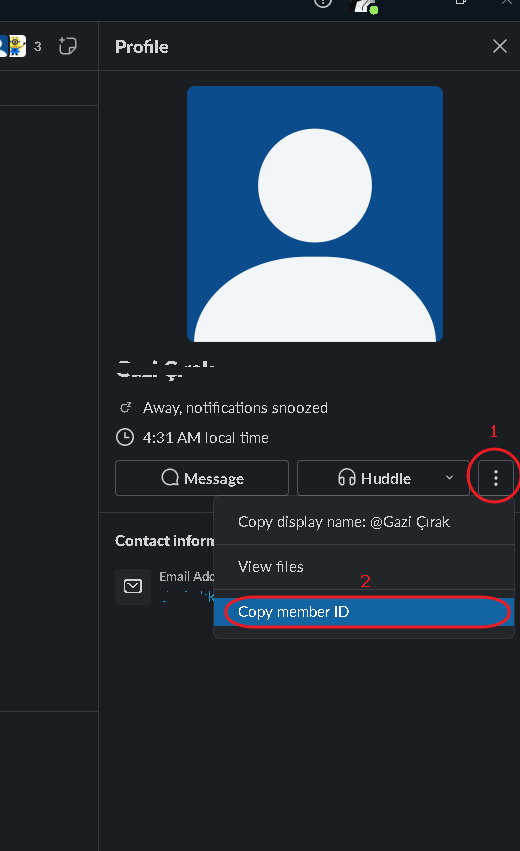

# Upwork Unread Message Alert

## Purpose

[Upw](https://upwork.com) sends unread messages notification to the subscribed mail, but it should not be checked on other devices.<br>
Because they track the location and if the location is different than the subscribed one the account is suspended.<br>
So this app checks unread message notifications in the subscribed mail on the original device and send another new mail notification to desired email.

## Setup

- [ ] Clone the repo

- [ ] Initialize venv

```cmd
python -m venv venv
```

- [ ] Start venv

```cmd
.\venv\Scripts\activate
```

- [ ] install requirements

```cmd
pip install -r requirements.txt
```

- [ ] Run the file (Set proper configuration before doing this, see the [Configuration](#configuration) section below)

```cmd
python main.py
```

## Configuration

- [ ] owner<br>
- name<br>
This is your nick name to be displayed in slack.<br>
- user_id<br>
You can copy your user id from profile<br>

- [ ] source_email_accounts<br>
email credential information to be checked
